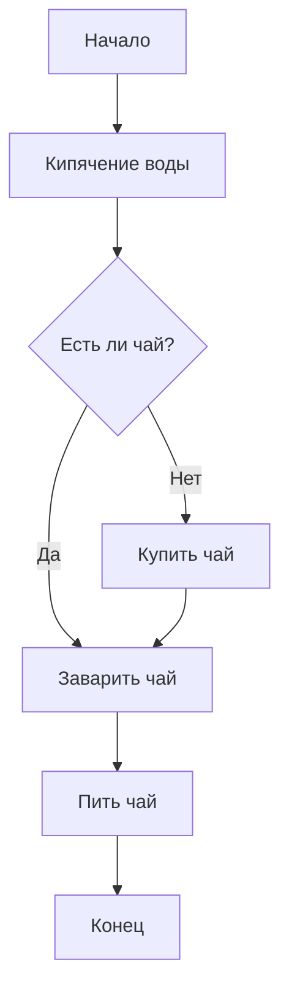
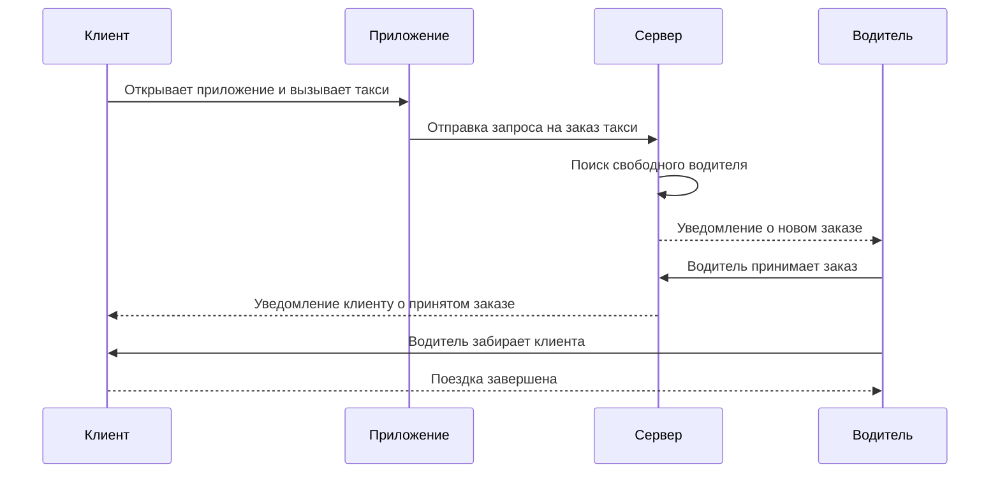
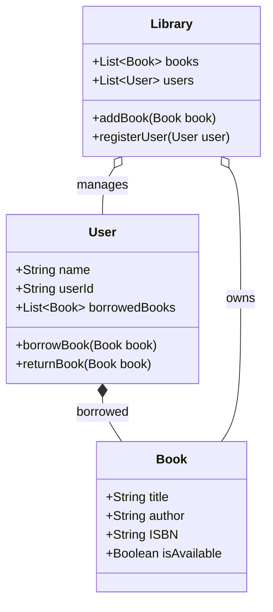
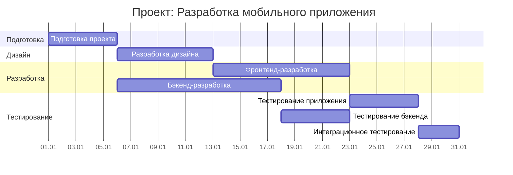
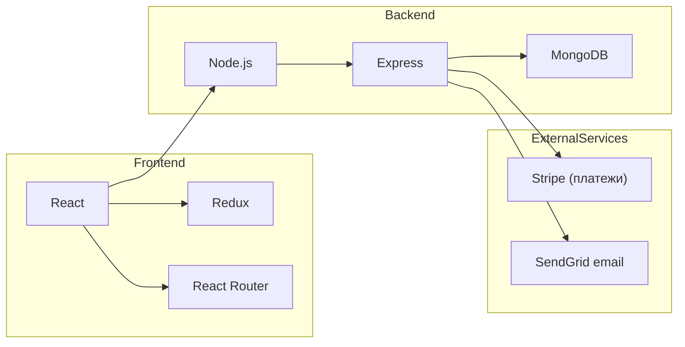
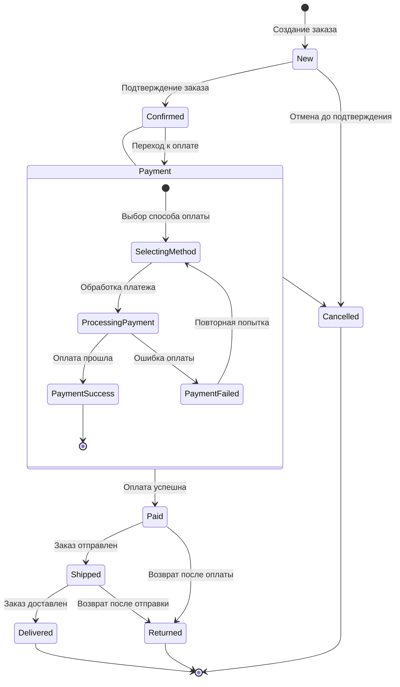
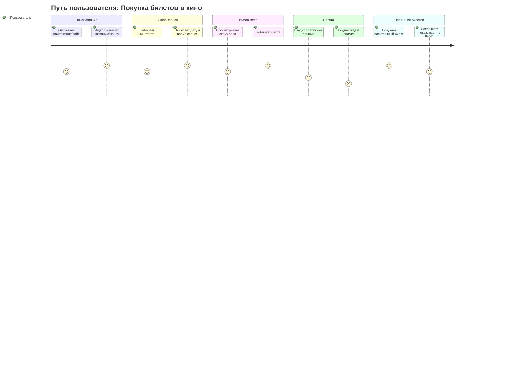
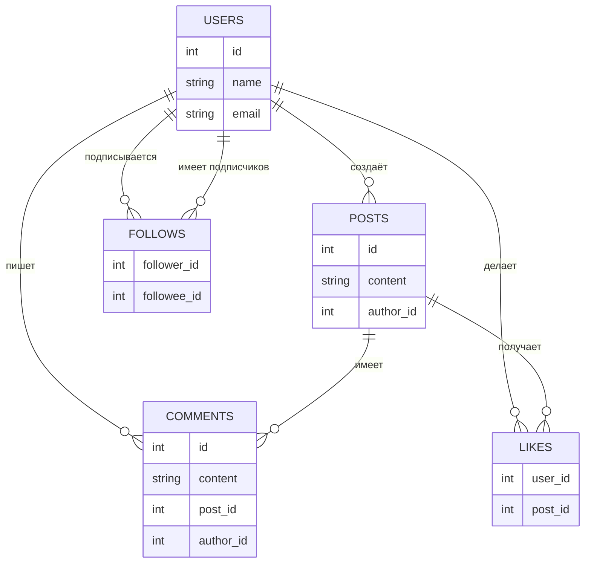
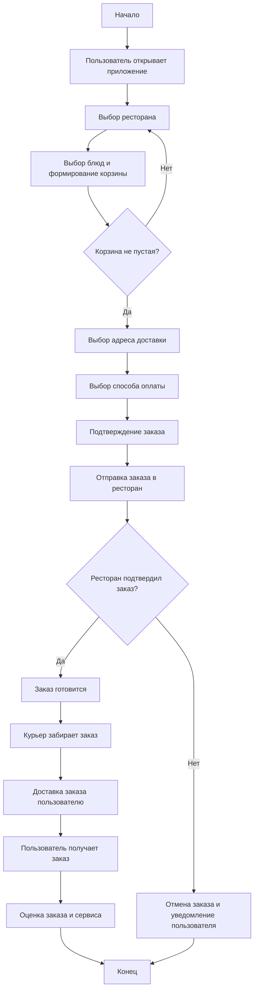
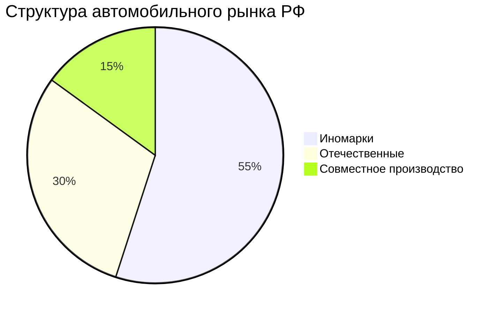

## 📘 Задания по Mermaid

В этом репозитории собраны **решения всех заданий** из файла `Mermaid.md` репозитория `mfua`.  
Все диаграммы оформлены в одном файле `README.md` с использованием синтаксиса **Mermaid**.

---

## 🧊 Уровень 1 — базовый синтаксис

### 🔹 Задание 1.1 — блок‑схема «Приготовление чая»

---

### 🔹 Задание 1.2 — диаграмма последовательности «Заказ такси»

---

## 🧩 Уровень 2 — комплексные диаграммы

### 🔹 Задание 2.1 — диаграмма классов «Библиотечная система»

---

### 🔹 Задание 2.2 — диаграмма Ганта «Разработка мобильного приложения»

---

## 🚀 Уровень 3 — продвинутый

### 🔹 Задание 3.1 — архитектура веб‑приложения (граф зависимостей)

---

### 🔹 Задание 3.2 — диаграмма состояний «Заказ в интернет‑магазине»

---

## 🎯 Уровень 4 — экспертный

### 🔹 Задание 4.1 — User Journey Map «Покупка билетов в кино»

---

### 🔹 Задание 4.2 — ER‑диаграмма «Социальная сеть»

---

## 📦 Задание 5 — документация проекта «Сервис доставки еды»

### 🔹 Блок‑схема процесса заказа

---

## 🚗 Задание 6 — круговая диаграмма «Автомобили на российском рынке»

---

